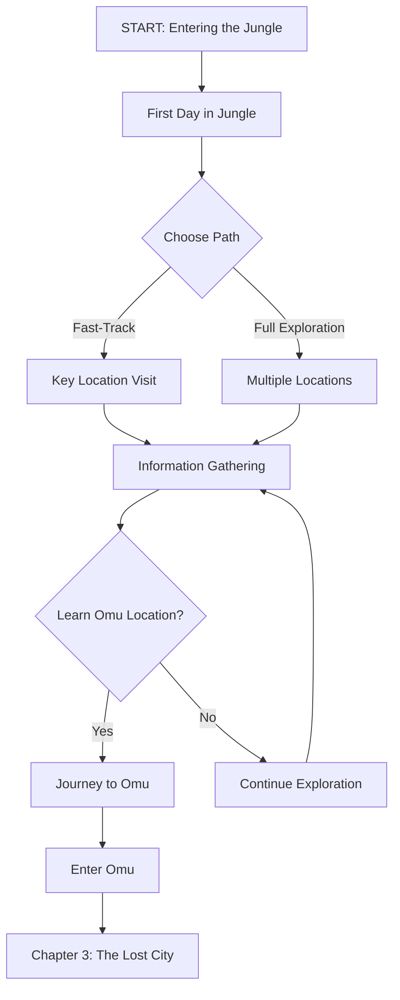

# Story Navigation: Chapter 2 - Choose Your Own Adventure

*Official source: Chapter 2: **pp. 37+***  
*Reference: [D&D 5E - Tomb of Annihilation.pdf](../../D&D%205E%20-%20Tomb%20of%20Annihilation.pdf)*

## Overview

This navigation guide helps DMs follow the story flow based on player choices. Use this as a "choose your own adventure" style reference to quickly find the next scene based on what players decide to do.

## Story Flow Overview

## Major Decision Points

### Decision Point 1: First Day Approach

**After entering the jungle, players choose:**

- **Follow Guide Closely** → [First-Day-in-Jungle.md](../01-Entering-the-Jungle/First-Day-in-Jungle.md) → Continue to daily travel
- **Explore Immediately** → [Initial-Encounters.md](../01-Entering-the-Jungle/Initial-Encounters.md) → First day encounters
- **Ask Questions** → Guide provides information → Continue travel

### Decision Point 2: Travel Pace

**During daily travel, players choose:**

- **Normal Pace** → [Hex-Crawling.md](../02-Travel-Mechanics/Hex-Crawling.md) → 1 hex per day
- **Fast Pace** → [Hex-Crawling.md](../02-Travel-Mechanics/Hex-Crawling.md) → 2 hexes per day (exhaustion risk)
- **Slow Pace** → [Hex-Crawling.md](../02-Travel-Mechanics/Hex-Crawling.md) → 0.5 hexes per day (safer)

### Decision Point 3: Destination Choice

**Players choose where to go:**

- **Fort Beluarian** → [Fort-Beluarian.md](../03-Key-Locations/Fort-Beluarian.md) → Flaming Fist information
- **Camp Vengeance** → [Camp-Vengeance.md](../03-Key-Locations/Camp-Vengeance.md) → Order of the Gauntlet
- **Orolunga** → [Orolunga.md](../03-Key-Locations/Orolunga.md) → Oracle information
- **Kir Sabal** → [Kir-Sabal.md](../03-Key-Locations/Kir-Sabal.md) → Aarakocra village
- **Mbala** → [Mbala.md](../03-Key-Locations/Mbala.md) → Hag's lair
- **Nangalore** → [Nangalore.md](../03-Key-Locations/Nangalore.md) → Ancient ruins
- **Other Locations** → [Other-Locations.md](../03-Key-Locations/Other-Locations.md) → Various locations
- **Follow Undead** → Track undead activity → May lead to Omu

### Decision Point 4: Information Gathering

**Players choose how to learn about Omu:**

- **Visit Oracle** → [Oracle-Information.md](../06-Information-Gathering/Oracle-Information.md) → Direct information
- **Talk to NPCs** → [NPC-Information.md](../06-Information-Gathering/NPC-Information.md) → Information from various sources
- **Explore Ruins** → [Clue-Gathering.md](../06-Information-Gathering/Clue-Gathering.md) → Clues from ancient sites
- **Follow Undead** → Track undead patterns → [Finding-Omu.md](../06-Information-Gathering/Finding-Omu.md) → Directional clues

### Decision Point 5: Ready for Omu?

**After gathering information, players decide:**

- **Ready to Go** → [Chapter-Exit-Conditions.md](../07-Chapter-Transition/Chapter-Exit-Conditions.md) → Verify readiness
- **Need More Info** → Return to [06-Information-Gathering](../06-Information-Gathering/) → Continue gathering
- **Need Supplies** → [Resource-Management.md](../02-Travel-Mechanics/Resource-Management.md) → Resupply

### Decision Point 6: Journey to Omu

**Players begin final journey:**

- **Begin Journey** → [Journey-to-Omu.md](../07-Chapter-Transition/Journey-to-Omu.md) → Travel to Omu
- **Final Preparations** → [Preparing-for-Chapter-3.md](../07-Chapter-Transition/Preparing-for-Chapter-3.md) → Rest and prepare
- **Enter Omu** → Chapter 3 begins → The Lost City of Omu

## Fast-Track vs Full Experience

### Fast-Track Path

**For DMs who want to streamline Chapter 2:**

1. **First Day** → [First-Day-in-Jungle.md](../01-Entering-the-Jungle/First-Day-in-Jungle.md) - Quick introduction
2. **Travel Summary** → Summarize days of travel, focus on key encounters
3. **Key Location** → Visit one major location (Orolunga recommended for information)
4. **Information** → [Oracle-Information.md](../06-Information-Gathering/Oracle-Information.md) - Get Omu location
5. **Journey** → [Journey-to-Omu.md](../07-Chapter-Transition/Journey-to-Omu.md) - Travel to Omu
6. **Enter Omu** → Chapter 3 begins

**Time:** 1-2 sessions

### Full Experience Path

**For DMs who want complete exploration:**

1. **First Day** → [First-Day-in-Jungle.md](../01-Entering-the-Jungle/First-Day-in-Jungle.md) - Detailed introduction
2. **Daily Travel** → [Hex-Crawling.md](../02-Travel-Mechanics/Hex-Crawling.md) - Full hex-crawl
3. **Multiple Locations** → Visit several key locations
4. **Information Gathering** → Gather from multiple sources
5. **Survival Challenges** → Full resource management and survival
6. **Journey** → [Journey-to-Omu.md](../07-Chapter-Transition/Journey-to-Omu.md) - Detailed journey
7. **Enter Omu** → Chapter 3 begins

**Time:** 5-10+ sessions

## Quick Reference: Scene Transitions

### From First Day to Travel

- **After First Day** → [Hex-Crawling.md](../02-Travel-Mechanics/Hex-Crawling.md) - Begin daily travel routine

### From Travel to Location

- **Reach Location** → [03-Key-Locations](../03-Key-Locations/) - Choose specific location

### From Location to Information

- **Gather Information** → [06-Information-Gathering](../06-Information-Gathering/) - Choose information source

### From Information to Journey

- **Learn Omu Location** → [Chapter-Exit-Conditions.md](../07-Chapter-Transition/Chapter-Exit-Conditions.md) - Verify readiness
- **Begin Journey** → [Journey-to-Omu.md](../07-Chapter-Transition/Journey-to-Omu.md) - Travel to Omu

### From Journey to Chapter 3

- **Reach Omu** → [Preparing-for-Chapter-3.md](../07-Chapter-Transition/Preparing-for-Chapter-3.md) - Final preparations
- **Enter Omu** → Chapter 3 begins

## Navigation Tips

1. **Follow Player Interest**: If players are interested in a location, go there
2. **Multiple Information Sources**: Players don't need to visit every location - 2-3 sources are enough
3. **Pace Encounters**: Use encounters to advance plot, not just random combat
4. **Resource Management**: Track resources but don't make it tedious
5. **Information Delivery**: Ensure players learn Omu's location before Chapter 3

## Related Documents

- [Chapter-Overview.md](./Chapter-Overview.md) - Chapter 2 overview
- [Session-Flow.md](./Session-Flow.md) - High-level session structure
- [Fast-Track-Chapter-2.md](../99-Reference-Materials/Fast-Track-Chapter-2.md) - Condensed guide
- [Hex-Crawling.md](../02-Travel-Mechanics/Hex-Crawling.md) - Travel mechanics
- [Finding-Omu.md](../06-Information-Gathering/Finding-Omu.md) - Information about Omu
